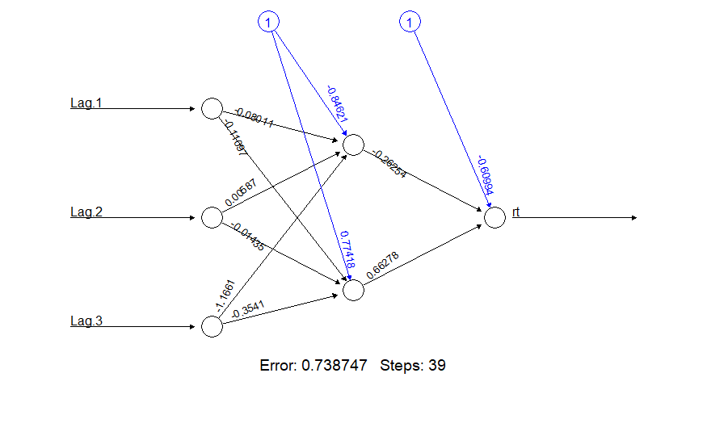

# Time-Series-Models
This repository contains sample implementations of several popular time series models, including, but not limited to, univariate, multivariate, Machine Learning, and ARCH style volatility models. All model implementations use the quantmod package to obtain time series data from Yahoo Finance.

## Neural-Network models
This implementation uses the neuralnet() function of the neuralnet (v1.44.2) package to generate the model and its parameters.
Visual representation of a 3-2-1 feed forward neural network:

## Univariate ARMA models:
This model implementation uses the arima.sim() and eacf() functions of the TSA (v1.2) package
